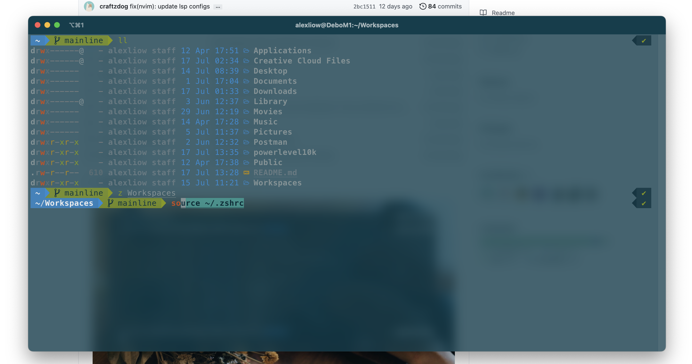

# dotfiles

## Description
Configuration files for current dev environment

# Install instructions
1. git clone my dotfiles repo
2. Move all the files (there's hidden files too) into the home directory of new computer
3. Now you can delete the dotfiles dir (which is empty)
4. Run `p10k configure` to install the fonts, so that the special characters look right
5. Install homebrew on computer (unrelated)
6. Install zsh dependencies
7. Optional - I reinstalled oh my zsh with the curl command, not sure if this was necessary

## homebrew packages
Some of the packages used in !oh-my-zsh were installed using homebrew. Was not sure how to include those packages within dotfiles repo so for now will be listing them below.

* exa
* peco

# other zsh plugins were installed using (git clone mostly)
* They are located in .oh-my-zsh/custom/plugins

## TODO
* One improvement could be switching brew packages to be managed through zsh plugins (use zsh-exa or zsh-peco)
 * Caveat: zsh shell seems significantly slower when adding more plugins
* Add a plugin manager (antigen or antibody)
* Add peco change directory mapped to Ctrl + F. Wasn't able to find a package for this

## Example in iterm2

